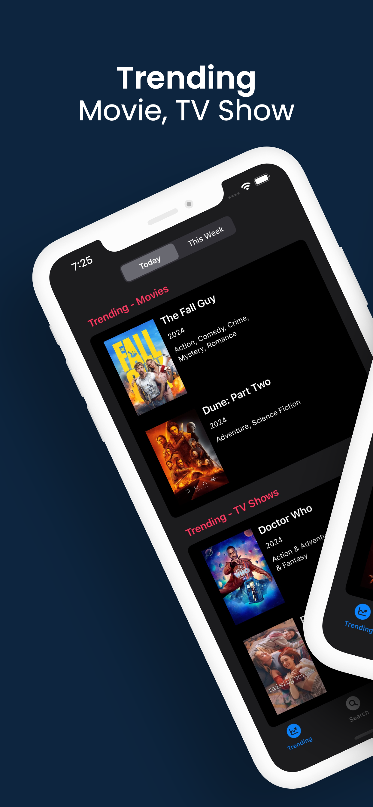
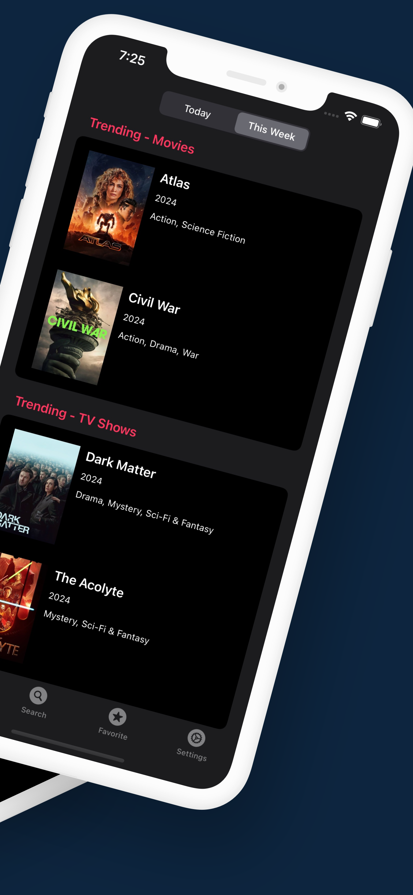
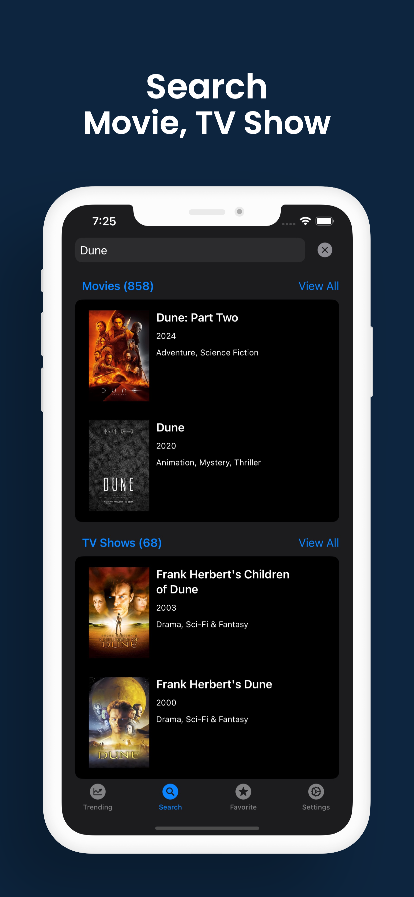
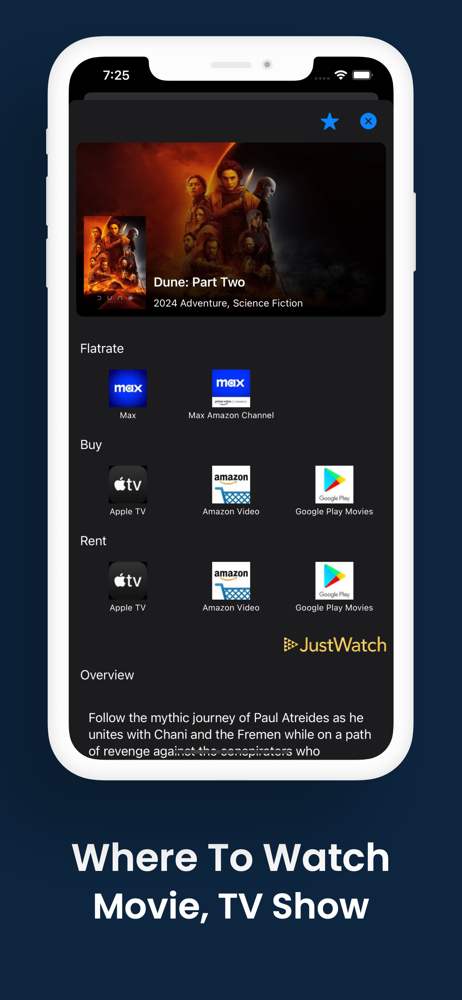
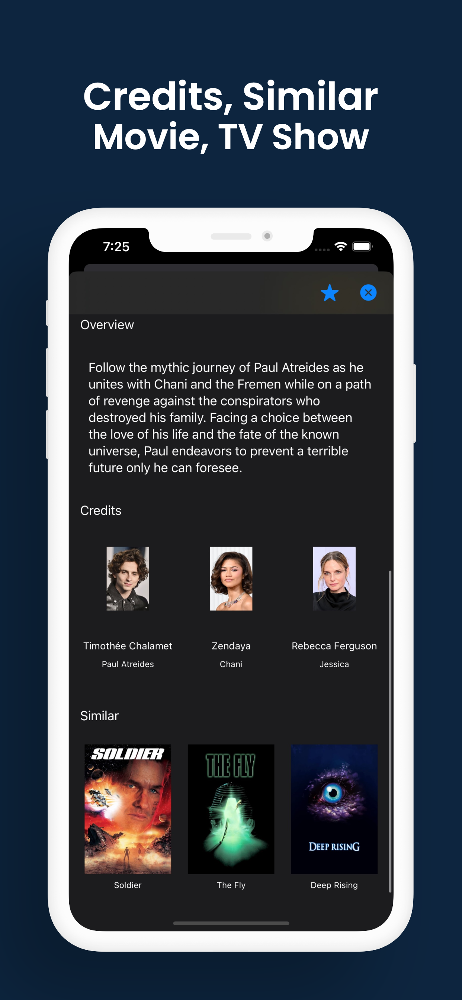
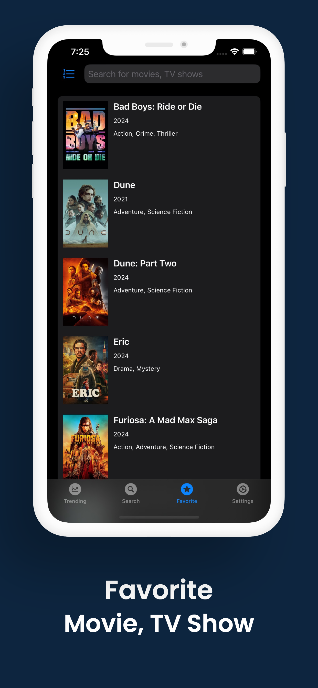
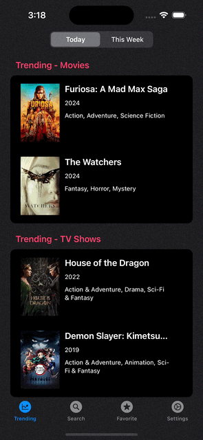

# WhereToWatchSwiftUI

WhereToWatch - SwiftUI

|||||||
|:--:|:--:|:--:|:--:|:--:|:--:|

## 어디서 봐 Where To Watch - SwiftUI

영화, TV 프로그램을 어디서 볼 수 있는지 검색하세요

* 오늘 / 이번 주 트렌딩 영화, TV 프로그램 조회.
* 영화, TV 프로그램을 검색.
* 영화, TV 프로그램을 어디서 볼 수 있는지 확인.
* 영화, TV 프로그램 출연진과 비슷한 콘텐츠 확인.
* 즐겨찾기 목록 관리.

### 배운 점

* **SwiftUI** 기반의 뷰와 인터페이스 재구성.
* 코드의 **가독성** 및 **유지보수성**을 개선하기 위해 구조적인 **리팩토링**을 수행하고, 모듈화된 코드 작성.
* **Unit Test**를 통해 안정성 검증.

### 역할

* UIKit 기반의 앱을 최신 기술 적용 및 사용자 경험 향상을 위해 SwiftUI 로 리디자인 및 재개발.

### 개발 일정

| 일정 | 설명 |
| --- | --- |
| 2024.03.19 ~ 2024.06.05 | 개발 시작 ~ 심사 제출 |
| 2024.06.06 | 2.0.0 버전 출시 |

### 개발환경

### 미리보기

|||||
|:--:|:--:|:--:|:--:|
